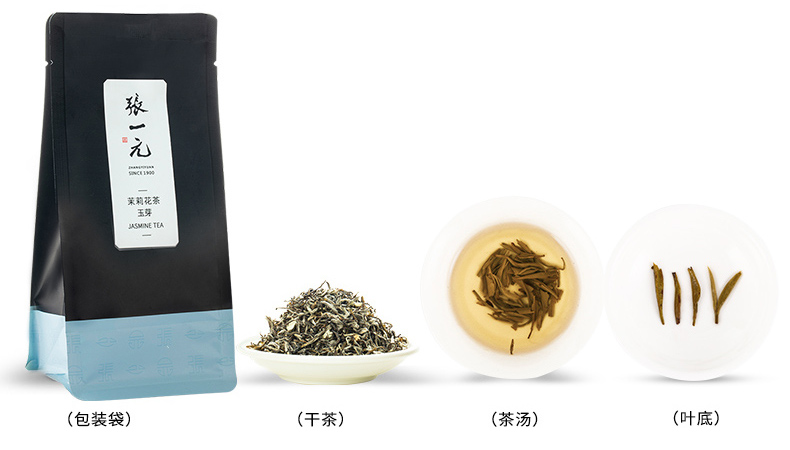

# 张一元 茉莉玉芽

产地：北京

外形：细紧匀直多毫，多锋苗

香气：鲜灵浓郁持久

口感：甘甜爽口

汤色：清澈明亮

叶底：匀亮细嫩柔软

<figure><figcaption></figcaption></figure>

\===

From MatF:

张一元自不必多说，北派茉莉代表。茉莉花茶的基茶在长期演变中扩展到了诸多绿茶外的品类，但个人认为最能体现茉莉花特色的还是正统的绿茶。茉莉玉芽是经过ELF师徒三代（指ELF、高中语文老师及老师的岳父）一致同意能够代表茉莉甜香澄澈、清新宜人的茶型的典范，是我暮春至早秋的主力单饮茶（冬季和佐餐我会选择更加醇厚浓重、烟熏味明显的的高山肉桂）。

茉莉不宜洗，香气在头道便会四溢。长期喝来的经验是水温应当比一般绿茶冲泡略高，时间要略微缩短，避免苦涩感沉积影响入口口感。一般来说香气可以至少维持二至三泡，之后的回甘会明显减弱。

经饮茶不多的友人提醒，这款的汤色和茶味都可能有些许浓重，新入茉莉的朋友可能需要略微适应一下。按照散装品评装换算近千元的斤价确实对于口粮茶档位来说有些许奢侈，但是个人认为这类短保质期的春茶大量囤积本身也会导致风味挥散，品评装买来数日饮完是体验最佳的。
