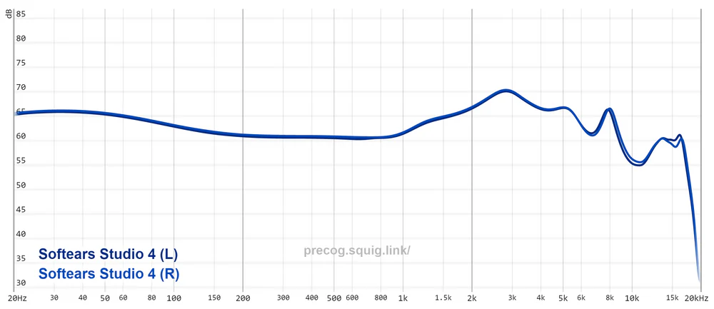

# Softears Studio 4

Softears Studio4 是一款专为专业音频工作者设计的高品质入耳式监听耳机。它采用 4 个平衡电枢单元，配合精密的三分频分频网络，能够提供极其准确和自然的声音表现。

### 主要特点

* 4 个高性能平衡电枢单元
* 专业级调音，适合录音棚和舞台监听
* 精密设计的三分频分频网络
* 平直的频率响应曲线
* 高精度 3D 打印耳腔
* 医用级树脂外壳，佩戴舒适
* 高纯度无氧铜线缆

### 技术规格

* 阻抗：12Ω
* 灵敏度：123dB/Vrms
* 频率响应范围：5Hz-40kHz
* 有效频率范围：20Hz-20kHz
* 接口：0.78mm 双针
* 插头：3.5mm 单端

### 专业音质表现

Studio4 采用了 4 个定制的平衡电枢单元，通过精心设计的三分频分频网络，实现了非常平直的频率响应。它能够准确还原原始音频信号，适合录音工程师和舞台表演者使用。\
超宽的频率响应范围和高分辨率的音质表现，让 Studio4 能够呈现出丰富的细节和层次感。无论是在录音棚监听还是现场表演，Studio4 都能提供专业级的音质体验。

### 舒适的佩戴体验

Studio4 采用高精度 3D 打印耳腔，外壳由医用级树脂材料制成。这不仅确保了卓越的声学性能，还带来了出色的佩戴舒适度。即使长时间使用也不会感到不适。

### 高品质配件

Studio4 配备了一条高纯度无氧铜线缆，采用标准 0.78mm 双针接口和 3.5mm 单端插头。优质的线材能够最大程度地传输音频信号，保证音质不失真。\
总的来说，Softears Studio4 凭借其专业级的音质表现和舒适的佩戴体验，是一款非常值得推荐的高端入耳式监听耳机。无论是录音工程师、舞台表演者，还是追求高品质音乐重放的发烧友，Studio4 都是一个理想的选择。🎧🎵

<figure><figcaption></figcaption></figure>

<figure><figcaption></figcaption></figure>

<figure><figcaption></figcaption></figure>

<figure><figcaption></figcaption></figure>

\======

From 空格：

公模的佩戴体验比较一般，有实力上定制。耳机的素养是不错的，比较均衡，同价位好选择不多。

调音有一些水家风格，频响曲线的主要特点是 6K 谷、8K 峰，如果是认真做混音的话可以上个校正文件。另外现在市面上的耳机普遍 10K+ 会给的比较大， 如果用这条混音有可能会出现其他耳机上回放 10K+ 比较刺的情况，认真干活的话建议在最终定版之前多条交叉听，对于工作来说高频不刺更不容易疲劳，而且这款在 Hi-mid 这一块也不丢解析。
