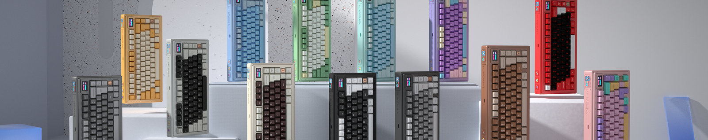

---
layout:
  title:
    visible: true
  description:
    visible: false
  tableOfContents:
    visible: true
  outline:
    visible: true
  pagination:
    visible: true
---

# Better 75 客制化套件

- 铍铜弹性：优化了磁吸供电接口的铍铜弹性，具有更好的弹性及耐用性。
- 敲打手感：设计经过多次优化，提供了软弹的敲击手感。
- 树脂涂层：全部颜色增加闪粉工艺及消光粉处理的树脂涂层，提升了高级感并增加抗油且亲肤的特性。
- 多色外观：提供 11 种颜色供用户选择，满足个性化需求。
- 定制 UV 打印铭牌：可选配定制铭牌，使产品具有更多个性化选择。
- 快拆结构：增加了包括磁吸快拆 1U 铭牌和 USB 接收器收纳仓小铭牌等在内的快拆结构设计，方便用户根据需求更换。
- 价格：除额外购买定制铭牌等选件，团购价格 1199 元保持不变，为用户提供了性价比极高的选择。

推荐这款产品不仅因为其高性能的硬件组件和精美的外观设计，还因为其富有弹性的击打手感、抗油且亲肤的树脂涂层，以及多样化的定制选项，所有这些优点都以一个合理的价格呈现，确保用户获得高质量和高价值的商品。

 
=====
 

From 空格：

这个套件我订了第一批还没到。

关于套件，现阶段来说铍铜弹力臂（怒喵是类似系统，材质不一样）是比较好的结构，整版可以有一个比较好的弹性形变，对于打字来说会提供一个非常不错的体验。

Gasket 其实已经不是什么新鲜的东西了，早几年还是算高端的，但是现在几百元的也能做，Gasket 受限于结构本身能够提供的软弹触感还是有限的，在同样的开槽情况下如果追求形变还是上弹力臂会好一些。

这个套件本身价格不高，各方面的配置、设计都还不错，所以果断入了，铍铜其实还是比较少见的，能在千元左右买到这个级别的套件非常不错。但是这个套件本身和 OWLAB 的原版，以及怒喵的系统都是有区别的，不是完全一致的东西，弹力臂本身的材质、形状、预压都会影响手感。