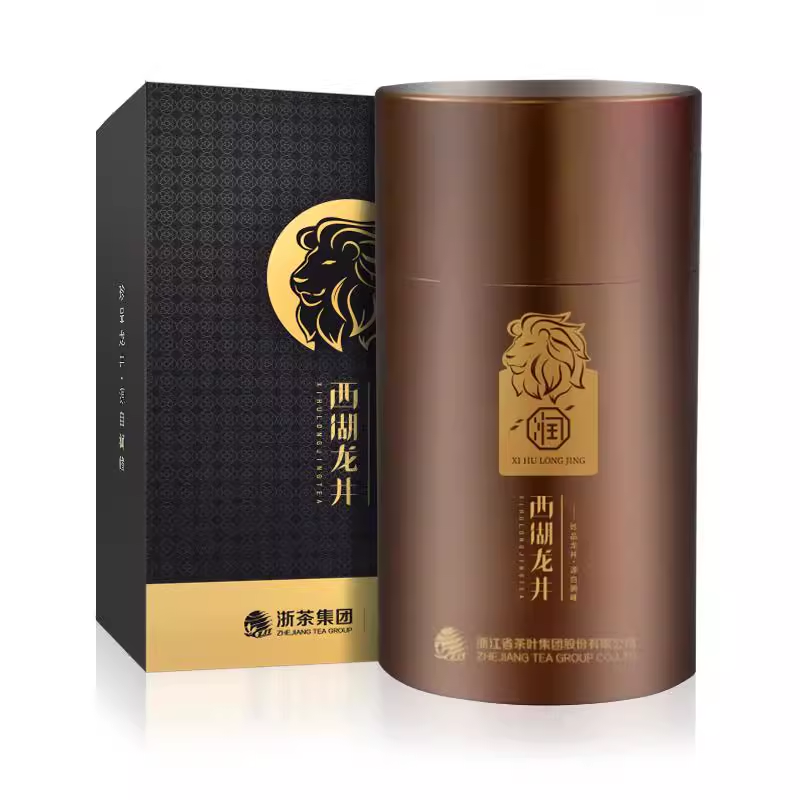

---
layout:
  title:
    visible: true
  description:
    visible: false
  tableOfContents:
    visible: true
  outline:
    visible: true
  pagination:
    visible: true
---

# 狮峰牌西湖龙井 - 润字精品

狮峰龙井润字精品以其醇厚的汤感和良好的茶气特别引人注目。

茶叶色泽黄绿，条索匀整度一般，香气属中等水平。在品饮过程中，第一泡能给人以浓郁的香气和较高的醇厚度，快速生津，苦涩度低，还有可观的回甘。虽然到了第二、第三泡，香气略有减弱，但茶汤感觉依然厚实，继续滋润着每一位品茶者的口感。

 
=====
 

From 空格：

AI 是不懂茶的，这款茶在网上能找到的评价也比较少，还是得我来。

先声明，我只是一个普通茶客，不是什么品鉴师。

首先今年（2024）我入坑龙井第二年，今年特意是明前就订了，从大品牌两家到小茶农一家都有购茶，数款茶斤价都不低于 1000。一些老茶客可能会很喜欢喝小茶农的茶，首先老茶树之类是有保证的，茶本身品质不差，但是和品牌茶精品级比起来差距还是有的，小茶农的茶自带一些溢价，拉齐价位的话还是品牌茶口味、香气会更好。除非是有特别的采购渠道，这里只谈淘宝购茶。

狮峰的精品是斤价 2500 左右，明前预定会更实在一些，但是不会下 2000，我个人今年纵向对比了下位的沁字，确实是开罐就能感觉到的明显差异。如果经济实力足够首选润字是没错的。

这个茶确实是不经多泡，多泡之后香气会有明显的寡淡感，第一泡是相当浓郁的，个人认为对得起这个价位，龙井本身就不便宜，上到精品级都是一个比一个贵的。

品牌横比的话，贡牌其实也不错，但是贡牌同级别的茶斤价要稍高，不送礼自己和的话还是要讲究一下价钱，价钱合适的话我觉得狮峰、贡牌都可买。

口粮茶可以往下降一档，没有必要一定要上 2000 的，没有喝过值得一品，品过了每年看实力采买，明后其实买起来不便宜了。与其去抢东方树叶，确实不如正经来买一罐龙井。

如果只是想喝一口龙井不是特别在乎茶什么品质，一般的明前龙井 43 做口粮喝也是不错的，不过不在我们好物的范围了，主打推荐的话我还是推荐精品级。改日可能会测贡牌的天赐，但是价确实高，估计来年吧。
